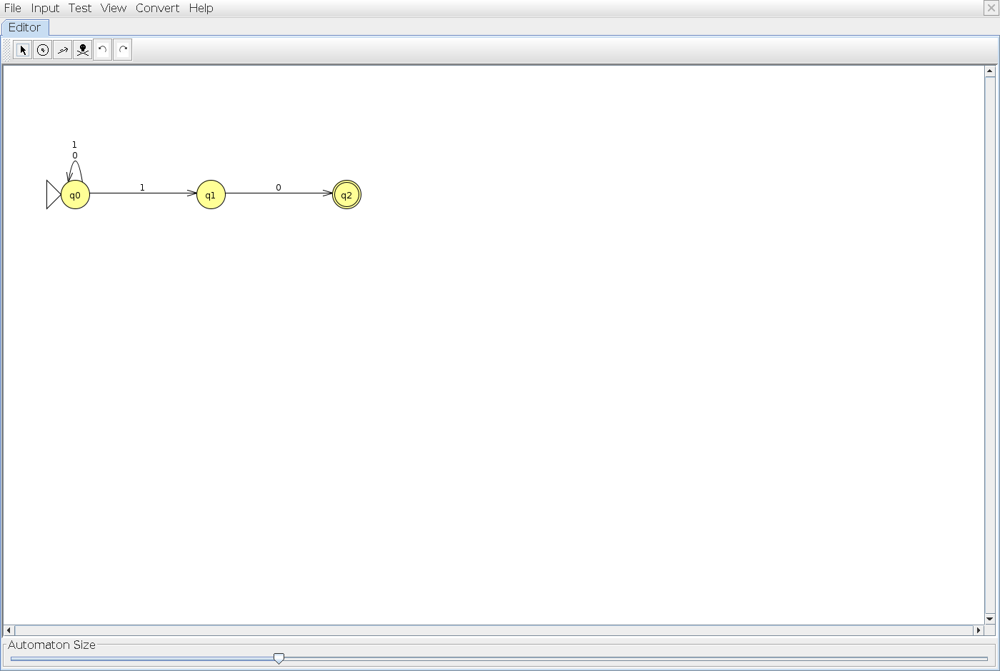
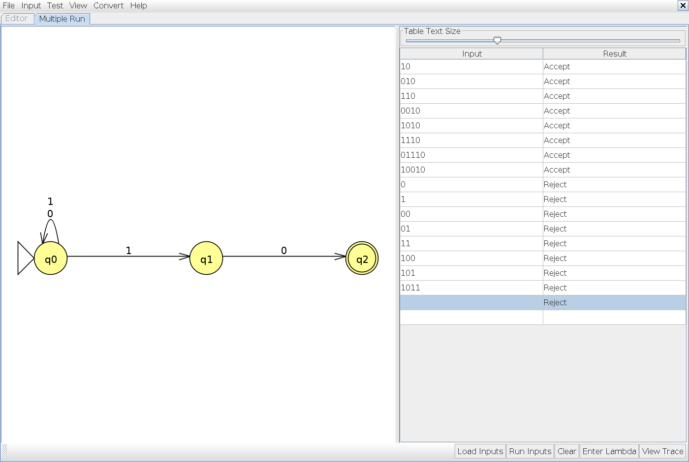

# Problem 07

**Language:** Binary strings that end with 10. Alphabet: {0, 1}.

Problem statement: [class example](https://github.com/esb5192/NFA-design-exercises-1/blob/main/n07r.md).

## NFA

q0 scans the prefix. On each 1 it keeps scanning and also guesses that this is the next-to-last symbol. That guess reaches q1; a final 0 reaches q2. q2 has no outgoing transitions, so a successful guess must end exactly at the end of the input.

Start state: q0. Accepting states: q2. Unlisted transitions have no destination; that computation path stops.

## Tests and expected results

Load `n07t.txt` through **Input → Multiple Run → Load Inputs**. It contains 8 accepted strings followed by 8 rejected strings. Select the last blank row and add the empty string using **Enter Lambda/Epsilon**; do not type the word `epsilon`. The appended empty-string case is also rejected.

| Input | Expected | Case |
|---|---|---|
| `10` | Accept | Shortest accepted |
| `010` | Accept | Typical / boundary |
| `110` | Accept | Typical / boundary |
| `0010` | Accept | Typical / boundary |
| `1010` | Accept | Typical / boundary |
| `1110` | Accept | Typical / boundary |
| `01110` | Accept | Typical / boundary |
| `10010` | Accept | Typical / boundary |
| `0` | Reject | Rejected boundary / near miss |
| `1` | Reject | Rejected boundary / near miss |
| `00` | Reject | Rejected boundary / near miss |
| `01` | Reject | Rejected boundary / near miss |
| `11` | Reject | Rejected boundary / near miss |
| `100` | Reject | Rejected boundary / near miss |
| `101` | Reject | Rejected boundary / near miss |
| `1011` | Reject | Rejected boundary / near miss |
| ε (add with Enter Lambda/Epsilon) | Reject | Empty input |

## JFLAP batch results

JFLAP Multiple Run completed all 17 tests: 8 accepted strings, 8 rejected strings, and the empty string (rejected). All results match the expected table. The blank input row with a Reject result is the empty-string test; the unused row below it is not a test.

