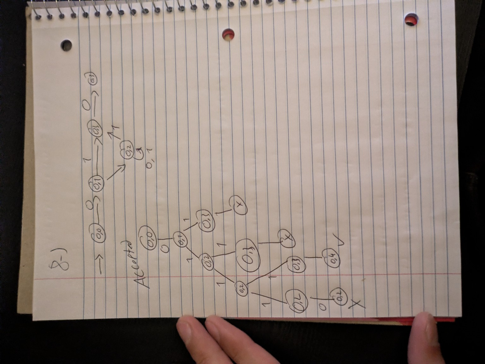

# Problem 08

**Language:** Binary strings that start with 01 and end with 10. Alphabet: {0, 1}.

Statement transcribed from [a supplied reference](https://github.com/c50-31-26F/Matthew_Sychareun_NFA_Design_Exercise_1/blob/main/NFA_Problems.md); confirm its numbering against Teams before submission.

## NFA

q0 and q1 enforce the prefix 01. After that 1, branch into q2 (scan more symbols) and q3 (guess that this same 1 starts the final 10). This second transition allows the overlapping shortest string 010. q2 guesses later occurrences of the final 10. q4 has no outgoing transitions.

Start state: q0. Accepting states: q4. Unlisted transitions have no destination; that computation path stops.

## Tests and expected results

Load `n08t.txt` through **Input → Multiple Run → Load Inputs**. It contains 8 accepted strings followed by 8 rejected strings. Select the last blank row and add the empty string using **Enter Lambda/Epsilon**; do not type the word `epsilon`. The appended empty-string case is also rejected.

| Input | Expected | Case |
|---|---|---|
| `010` | Accept | Shortest accepted |
| `0110` | Accept | Typical / boundary |
| `01010` | Accept | Typical / boundary |
| `01110` | Accept | Typical / boundary |
| `010010` | Accept | Typical / boundary |
| `011010` | Accept | Typical / boundary |
| `010110` | Accept | Typical / boundary |
| `0100010` | Accept | Typical / boundary |
| `0` | Reject | Rejected boundary / near miss |
| `1` | Reject | Rejected boundary / near miss |
| `01` | Reject | Rejected boundary / near miss |
| `10` | Reject | Rejected boundary / near miss |
| `0010` | Reject | Rejected boundary / near miss |
| `0100` | Reject | Rejected boundary / near miss |
| `0111` | Reject | Rejected boundary / near miss |
| `11010` | Reject | Rejected boundary / near miss |
| ε (add with Enter Lambda/Epsilon) | Reject | Empty input |

## JFLAP batch results

The actual JFLAP 7.1 Multiple Run completed all 17 tests: 8 accepted strings, 8 rejected strings, and the empty string (rejected). All results match the expected table. The blank input row with a Reject result is the empty-string test; the unused row below it is not a test.

## Hand-drawn computation: `01110`

Expected result: **Accept**.

The early guesses of the final 10 stop on another 1. The branch that guesses the last 1 reaches q4 after the final 0.

This is the original photograph supplied by the student, preserved without changing its handwritten content. The drawing follows the supplied class examples. Its input and state names are matched by the JFLAP captures below.

### Reading and correcting the handwritten notation

Some arrow labels are omitted in the photograph. In the NFA, q1 → q2 reads 1. In the tree, the last move q3 → q4 reads 0. The complete input traced is 01110. q4 is the accepting state.

A cross denotes a stopped or rejecting path. A check denotes a path that has consumed the entire input in a final state. The input label, missing transition labels, and accepting states are made explicit here so the photographed tree can be checked against the formal NFA.

### State sets after each input symbol

These sets include lambda closure at the start and after every consumed bit. JFLAP may also display dead configurations in red; those are excluded from the active-state sets.

| Symbols consumed | Active states | Remaining input |
|---|---|---|
| `ε` | {q0} | `01110` |
| `0` | {q1} | `1110` |
| `01` | {q2, q3} | `110` |
| `011` | {q2, q3} | `10` |
| `0111` | {q2, q3} | `0` |
| `01110` | {q2, q4} | `ε` |

### Matching JFLAP Step with Closure screenshots

These are actual JFLAP 7.1 screenshots for the same input as the handwritten tree.

**Initial configurations**

**After reading `0`**

**After reading `01`**

**After reading `011`**

**After reading `0111`**

**After reading `01110`**

