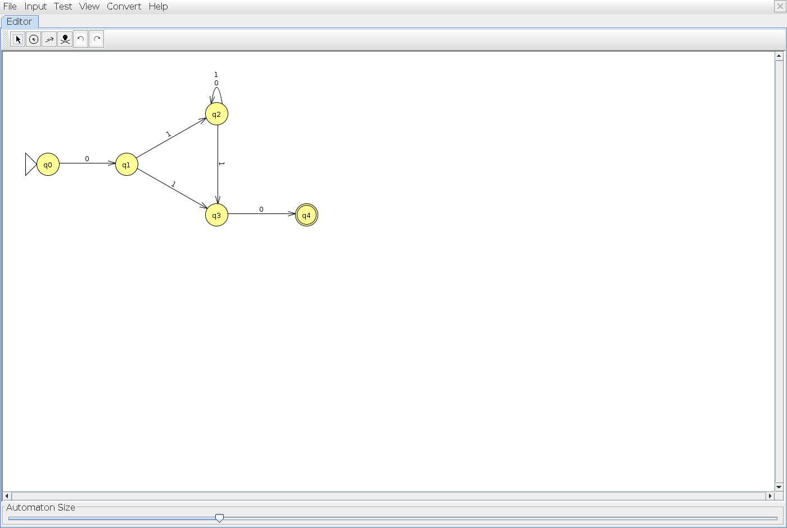
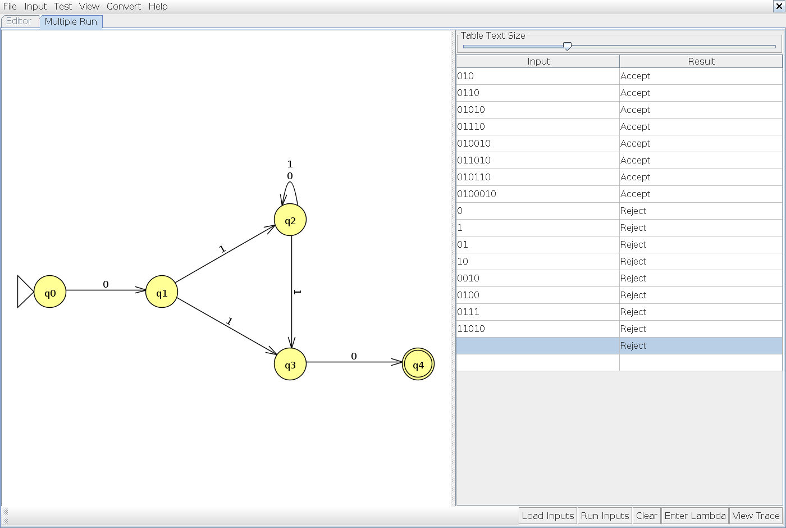
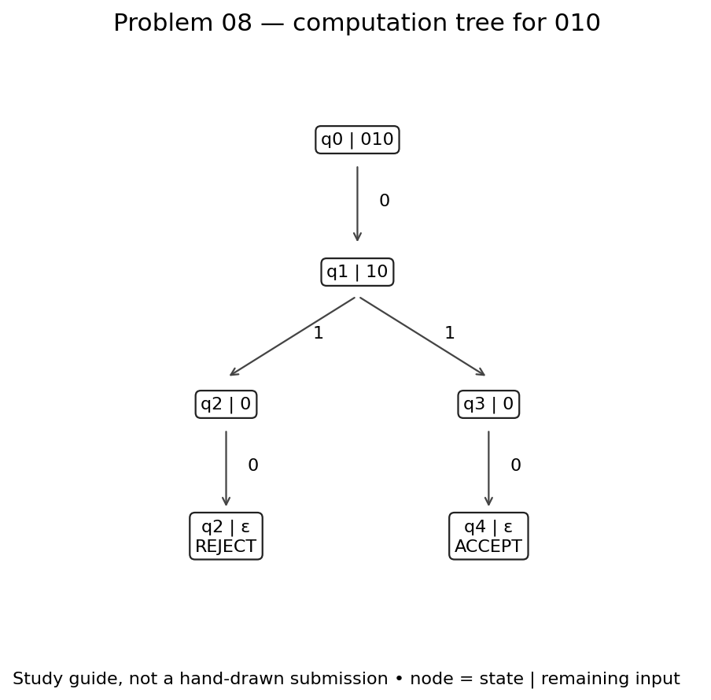
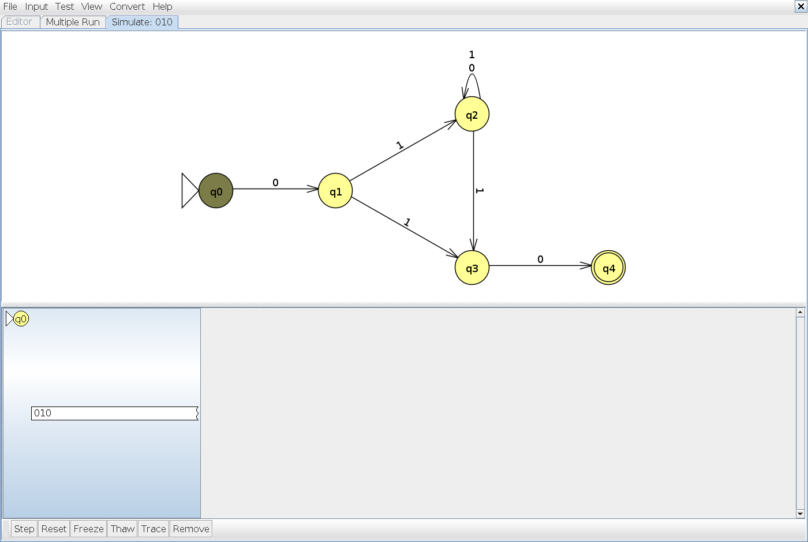

# Problem 08

**Language:** Binary strings that start with 01 and end with 10. Alphabet: {0, 1}.

Statement transcribed from [a supplied reference](https://github.com/c50-31-26F/Matthew_Sychareun_NFA_Design_Exercise_1/blob/main/NFA_Problems.md); confirm its numbering against Teams before submission.

## NFA

q0 and q1 enforce the prefix 01. After that 1, branch into q2 (scan more symbols) and q3 (guess that this same 1 starts the final 10). This second transition allows the overlapping shortest string 010. q2 guesses later occurrences of the final 10. q4 has no outgoing transitions.

Start state: q0. Accepting states: q4. Unlisted transitions have no destination; that computation path stops.

## Tests and expected results

Load `n08t.txt` through **Input → Multiple Run → Load Inputs**. It contains 8 accepted strings followed by 8 rejected strings. Select the last blank row and add the empty string using **Enter Lambda/Epsilon**; do not type the word `epsilon`. The appended empty-string case is also rejected.

| Input | Expected | Case |
|---|---|---|
| `010` | Accept | Shortest accepted |
| `0110` | Accept | Typical / boundary |
| `01010` | Accept | Typical / boundary |
| `01110` | Accept | Typical / boundary |
| `010010` | Accept | Typical / boundary |
| `011010` | Accept | Typical / boundary |
| `010110` | Accept | Typical / boundary |
| `0100010` | Accept | Typical / boundary |
| `0` | Reject | Rejected boundary / near miss |
| `1` | Reject | Rejected boundary / near miss |
| `01` | Reject | Rejected boundary / near miss |
| `10` | Reject | Rejected boundary / near miss |
| `0010` | Reject | Rejected boundary / near miss |
| `0100` | Reject | Rejected boundary / near miss |
| `0111` | Reject | Rejected boundary / near miss |
| `11010` | Reject | Rejected boundary / near miss |
| ε (add with Enter Lambda/Epsilon) | Reject | Empty input |

## JFLAP batch results

The actual JFLAP 7.1 Multiple Run completed all 17 tests: 8 accepted strings, 8 rejected strings, and the empty string (rejected). All results match the expected table. The blank input row with a Reject result is the empty-string test; the unused row below it is not a test.

## Computation exercise: `010`

Expected result: **Accept**.

The prefix and suffix can overlap: 010 must be accepted. Both q2 and q3 must be active after reading 01. The recorded JFLAP result matched the expected result.

### State sets after each input symbol

These use lambda closure at the start and after each symbol. Different paths can reach the same state; the set lists that state once.

| Symbols consumed | Active states | Remaining input |
|---|---|---|
| `ε` | {q0} | `010` |
| `0` | {q1} | `10` |
| `01` | {q2, q3} | `0` |
| `010` | {q2, q4} | `ε` |

### JFLAP state transitions

These are actual JFLAP 7.1 Step with Closure captures. Each numbered step reads one bit. JFLAP can retain dead configurations in red; the active-state table above excludes those dead paths. A green configuration accepts only when its input is exhausted.

**Initial configurations**

**After reading `0`**

**After reading `01`**

**After reading `010`**

### Hand-drawn computation tree — photo still needed

Draw the tree for `010` on paper, using the guide and state table above. Label each node `state | remaining input`, include every branch, and mark the terminal outcomes. Photograph your drawing and save it as `images/n08-hand-tree.jpg`. Replace this paragraph with the photograph before submission. The generated guide is study material and is not a hand-drawn photograph.
