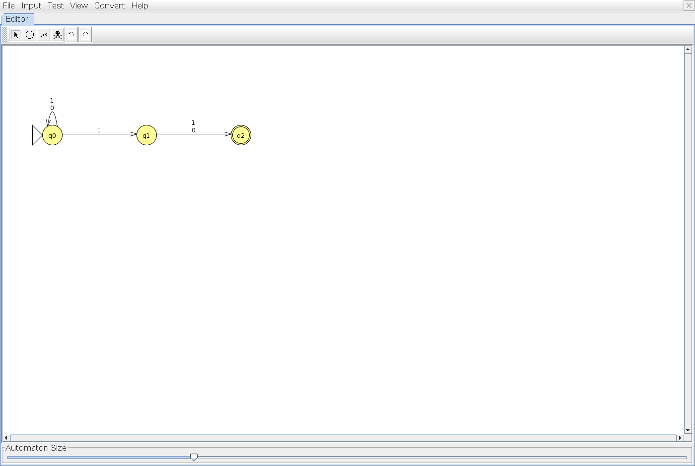
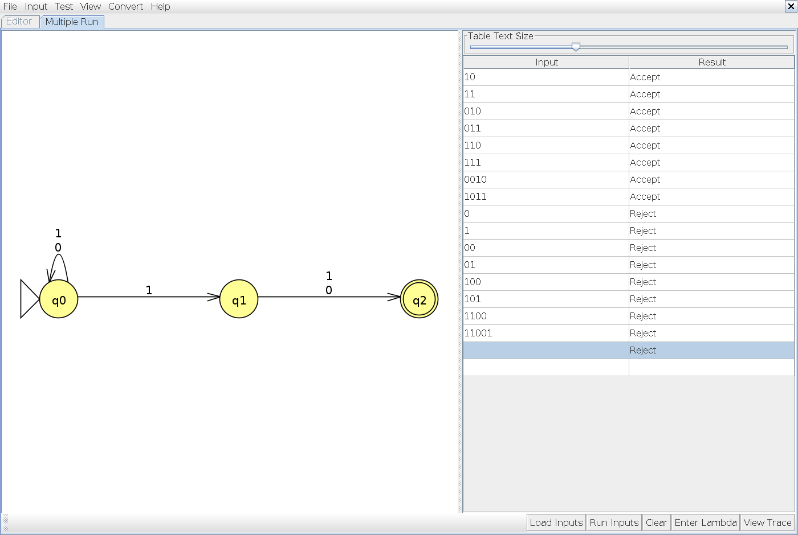
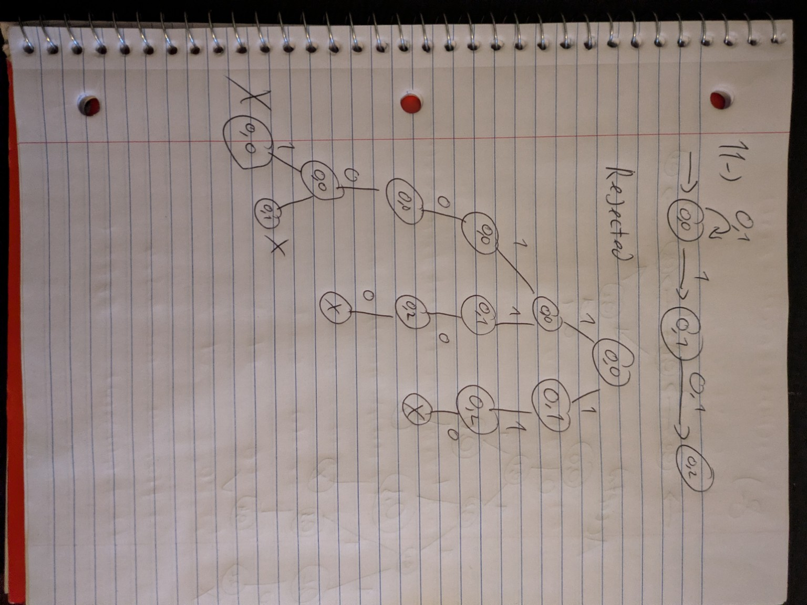
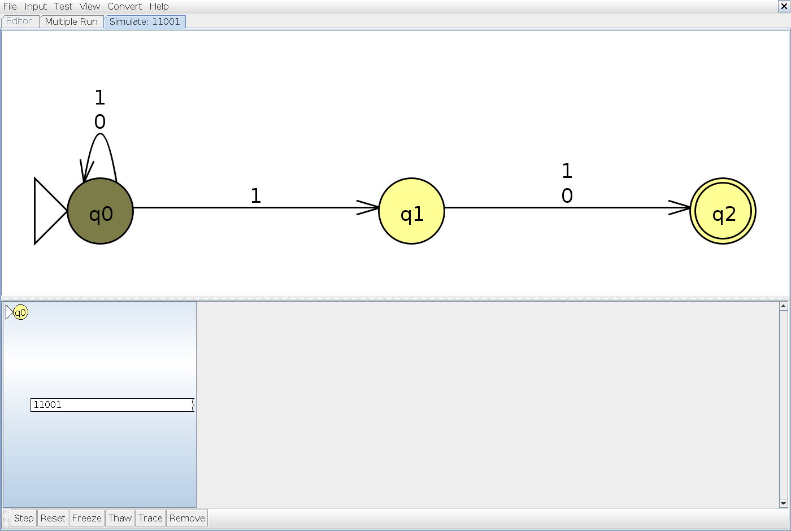
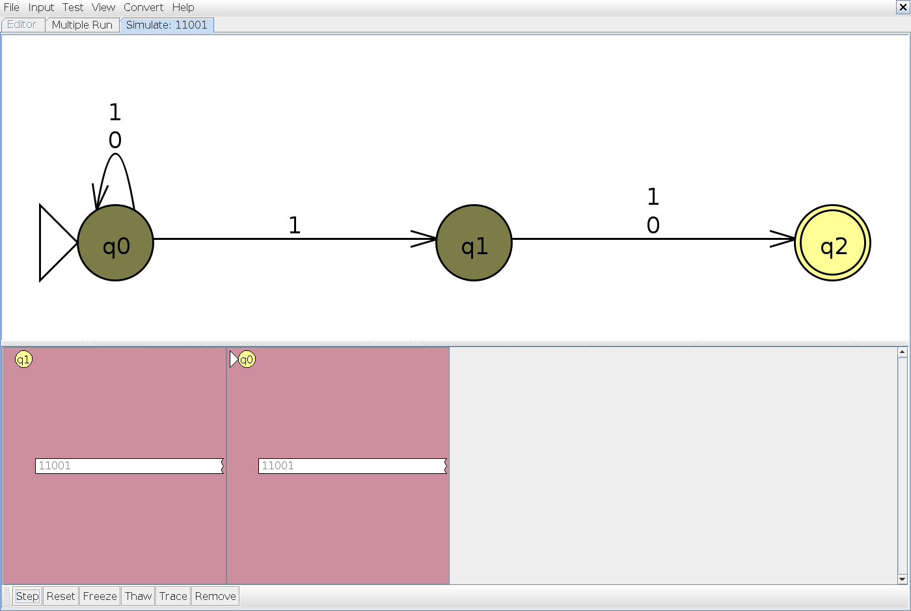

# Problem 11

**Language:** Binary strings whose second-to-last bit is 1. Alphabet: {0, 1}.

Statement transcribed from [a supplied reference](https://github.com/c50-31-26F/Matthew_Sychareun_NFA_Design_Exercise_1/blob/main/NFA_Problems.md); confirm its numbering against Teams before submission.

## NFA

q0 scans any prefix. On 1 it can stay in q0 or guess that this is the second-to-last bit and move to q1. Exactly one more bit reaches q2. A path that reaches q2 while input remains cannot continue.

Start state: q0. Accepting states: q2. Unlisted transitions have no destination; that computation path stops.

## Tests and expected results

Load `n11t.txt` through **Input → Multiple Run → Load Inputs**. It contains 8 accepted strings followed by 8 rejected strings. Select the last blank row and add the empty string using **Enter Lambda/Epsilon**; do not type the word `epsilon`. The appended empty-string case is also rejected.

| Input | Expected | Case |
|---|---|---|
| `10` | Accept | Shortest accepted |
| `11` | Accept | Typical / boundary |
| `010` | Accept | Typical / boundary |
| `011` | Accept | Typical / boundary |
| `110` | Accept | Typical / boundary |
| `111` | Accept | Typical / boundary |
| `0010` | Accept | Typical / boundary |
| `1011` | Accept | Typical / boundary |
| `0` | Reject | Rejected boundary / near miss |
| `1` | Reject | Rejected boundary / near miss |
| `00` | Reject | Rejected boundary / near miss |
| `01` | Reject | Rejected boundary / near miss |
| `100` | Reject | Rejected boundary / near miss |
| `101` | Reject | Rejected boundary / near miss |
| `1100` | Reject | Rejected boundary / near miss |
| `11001` | Reject | Rejected boundary / near miss |
| ε (add with Enter Lambda/Epsilon) | Reject | Empty input |

## JFLAP batch results

The actual JFLAP 7.1 Multiple Run completed all 17 tests: 8 accepted strings, 8 rejected strings, and the empty string (rejected). All results match the expected table. The blank input row with a Reject result is the empty-string test; the unused row below it is not a test.

## Hand-drawn computation: `11001`

Expected result: **Reject**.

The second-to-last bit is 0. Earlier paths reach final state q2 with unread input and then stop; the surviving complete paths end at q0 and q1.

This is the original photograph supplied by the student, preserved without changing its handwritten content. The drawing follows the supplied class examples. Its input and state names are matched by the JFLAP captures below.

### Reading and correcting the handwritten notation

The complete input traced is 11001, including both consecutive zeros. The final two branches from q0 both read 1. q2 is the accepting state, but a visit to q2 before the input ends does not accept the whole string.

A cross denotes a stopped or rejecting path. A check denotes a path that has consumed the entire input in a final state. The input label, missing transition labels, and accepting states are made explicit here so the photographed tree can be checked against the formal NFA.

### State sets after each input symbol

These sets include lambda closure at the start and after every consumed bit. JFLAP may also display dead configurations in red; those are excluded from the active-state sets.

| Symbols consumed | Active states | Remaining input |
|---|---|---|
| `ε` | {q0} | `11001` |
| `1` | {q0, q1} | `1001` |
| `11` | {q0, q1, q2} | `001` |
| `110` | {q0, q2} | `01` |
| `1100` | {q0} | `1` |
| `11001` | {q0, q1} | `ε` |

### Matching JFLAP Step with Closure screenshots

These are actual JFLAP 7.1 screenshots for the same input as the handwritten tree.

**Initial configurations**

**After reading `1`**

**After reading `11`**

**After reading `110`**

**After reading `1100`**

**After reading `11001`**

**Completion check: all paths reject**

This final click consumes no input; it marks the exhausted nonfinal configurations as rejected.

