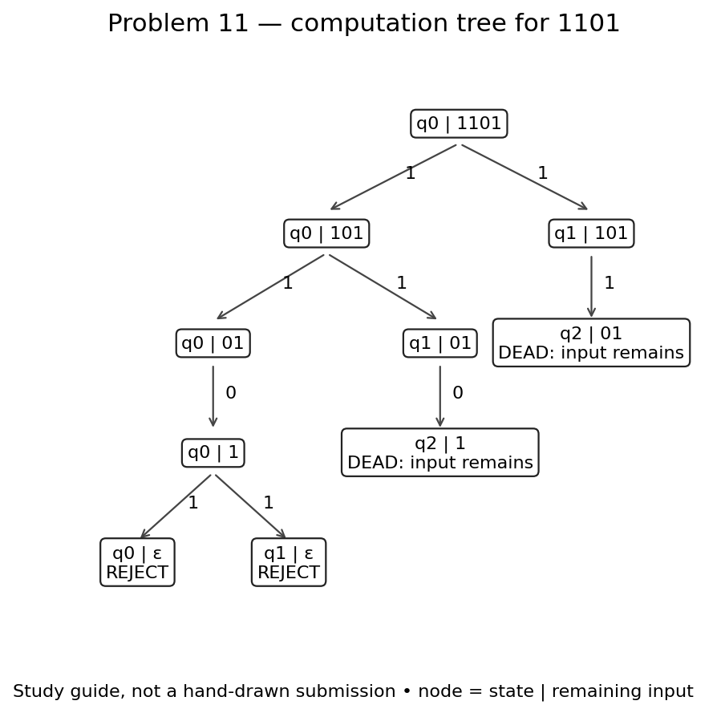

# Problem 11

**Language:** Binary strings whose second-to-last bit is 1. Alphabet: {0, 1}.

Statement transcribed from [a supplied reference](https://github.com/c50-31-26F/Matthew_Sychareun_NFA_Design_Exercise_1/blob/main/NFA_Problems.md); confirm its numbering against Teams before submission.

## NFA

q0 scans any prefix. On 1 it can stay in q0 or guess that this is the second-to-last bit and move to q1. Exactly one more bit reaches q2. A path that reaches q2 while input remains cannot continue.

Start state: q0. Accepting states: q2. Unlisted transitions have no destination; that computation path stops.

## Tests and expected results

Load `n11t.txt` through **Input → Multiple Run → Load Inputs**. It contains 8 accepted strings followed by 8 rejected strings. Select the last blank row and add the empty string using **Enter Lambda/Epsilon**; do not type the word `epsilon`. The appended empty-string case is also rejected.

| Input | Expected | Case |
|---|---|---|
| `10` | Accept | Shortest accepted |
| `11` | Accept | Typical / boundary |
| `010` | Accept | Typical / boundary |
| `011` | Accept | Typical / boundary |
| `110` | Accept | Typical / boundary |
| `111` | Accept | Typical / boundary |
| `0010` | Accept | Typical / boundary |
| `1011` | Accept | Typical / boundary |
| `0` | Reject | Rejected boundary / near miss |
| `1` | Reject | Rejected boundary / near miss |
| `00` | Reject | Rejected boundary / near miss |
| `01` | Reject | Rejected boundary / near miss |
| `100` | Reject | Rejected boundary / near miss |
| `101` | Reject | Rejected boundary / near miss |
| `1100` | Reject | Rejected boundary / near miss |
| `1101` | Reject | Rejected boundary / near miss |
| ε (add with Enter Lambda/Epsilon) | Reject | Empty input |

## JFLAP batch results

The actual JFLAP 7.1 Multiple Run completed all 17 tests: 8 accepted strings, 8 rejected strings, and the empty string (rejected). All results match the expected table. The blank input row with a Reject result is the empty-string test; the unused row below it is not a test.

## Computation exercise: `1101`

Expected result: **Reject**.

Reaching q2 before the input ends does not accept the whole string. For 1101 the second-to-last bit is 0, so every complete path rejects. The recorded JFLAP result matched the expected result.

### State sets after each input symbol

These use lambda closure at the start and after each symbol. Different paths can reach the same state; the set lists that state once.

| Symbols consumed | Active states | Remaining input |
|---|---|---|
| `ε` | {q0} | `1101` |
| `1` | {q0, q1} | `101` |
| `11` | {q0, q1, q2} | `01` |
| `110` | {q0, q2} | `1` |
| `1101` | {q0, q1} | `ε` |

### JFLAP state transitions

These are actual JFLAP 7.1 Step with Closure captures. Each numbered step reads one bit. JFLAP can retain dead configurations in red; the active-state table above excludes those dead paths. A green configuration accepts only when its input is exhausted.

**Initial configurations**

**After reading `1`**

**After reading `11`**

**After reading `110`**

**After reading `1101`**

**Completion check: all paths reject**

This extra click consumes no additional input; it lets JFLAP mark the exhausted, non-final configurations as rejected.

### Hand-drawn computation tree — photo still needed

Draw the tree for `1101` on paper, using the guide and state table above. Label each node `state | remaining input`, include every branch, and mark the terminal outcomes. Photograph your drawing and save it as `images/n11-hand-tree.jpg`. Replace this paragraph with the photograph before submission. The generated guide is study material and is not a hand-drawn photograph.
