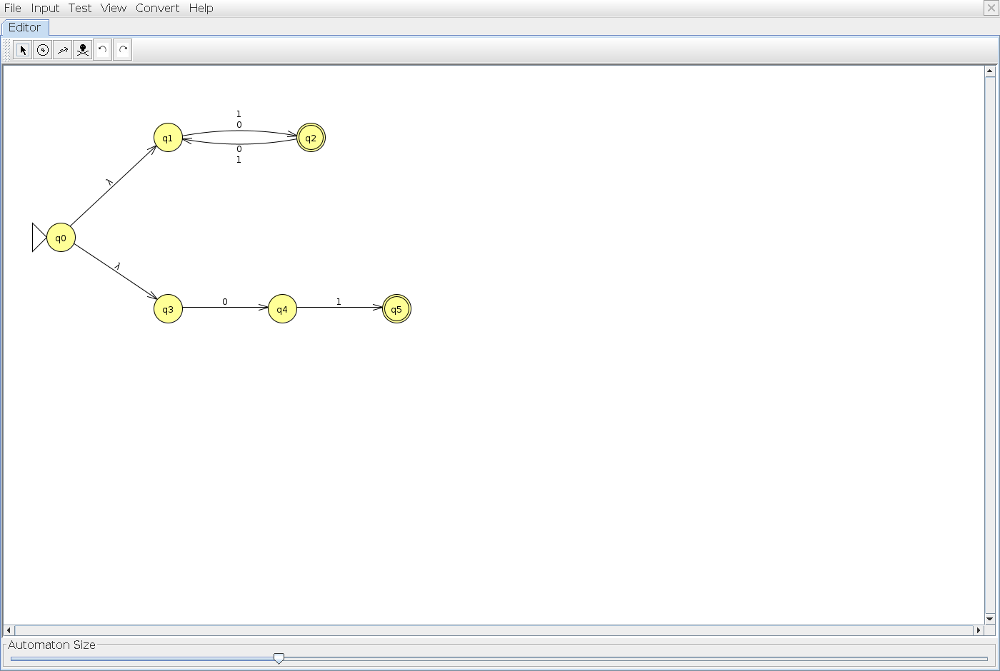
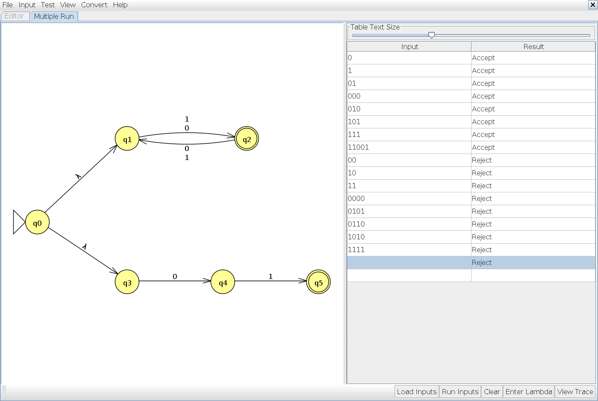

# Problem 23

**Language:** Binary strings that have odd length or are exactly 01. Alphabet: {0, 1}.

Problem statement: [class example](https://github.com/c50-31-26F/Matthew_Sychareun_NFA_Design_Exercise_1/blob/main/NFA_Problems.md).

## NFA

The two lambda branches implement OR. The upper branch alternates between q1 (even length) and q2 (odd length). The lower branch accepts exactly 01 at q5. It has no loops, so it does not accept every string containing 01.

Start state: q0. Accepting states: q2, q5. Unlisted transitions have no destination; that computation path stops.

## Tests and expected results

Load `n23t.txt` through **Input → Multiple Run → Load Inputs**. It contains 8 accepted strings followed by 8 rejected strings. Select the last blank row and add the empty string using **Enter Lambda/Epsilon**; do not type the word `epsilon`. The appended empty-string case is also rejected.

| Input | Expected | Case |
|---|---|---|
| `0` | Accept | Shortest accepted |
| `1` | Accept | Typical / boundary |
| `01` | Accept | Typical / boundary |
| `000` | Accept | Typical / boundary |
| `010` | Accept | Typical / boundary |
| `101` | Accept | Typical / boundary |
| `111` | Accept | Typical / boundary |
| `11001` | Accept | Typical / boundary |
| `00` | Reject | Rejected boundary / near miss |
| `10` | Reject | Rejected boundary / near miss |
| `11` | Reject | Rejected boundary / near miss |
| `0000` | Reject | Rejected boundary / near miss |
| `0101` | Reject | Rejected boundary / near miss |
| `0110` | Reject | Rejected boundary / near miss |
| `1010` | Reject | Rejected boundary / near miss |
| `1111` | Reject | Rejected boundary / near miss |
| ε (add with Enter Lambda/Epsilon) | Reject | Empty input |

## JFLAP batch results

JFLAP Multiple Run completed all 17 tests: 8 accepted strings, 8 rejected strings, and the empty string (rejected). All results match the expected table. The blank input row with a Reject result is the empty-string test; the unused row below it is not a test.

