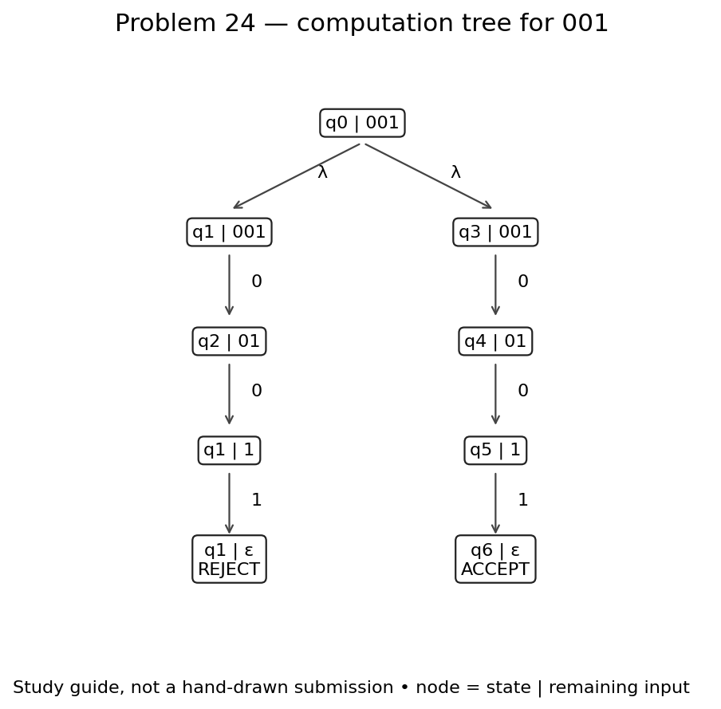

# Problem 24

**Language:** Binary strings that have an odd number of 0s or are exactly 001. Alphabet: {0, 1}.

Statement transcribed from [a supplied reference](https://github.com/c50-31-26F/Matthew_Sychareun_NFA_Design_Exercise_1/blob/main/NFA_Problems.md); confirm its numbering against Teams before submission.

## NFA

The upper branch tracks the parity of the number of 0s: q1 means even, q2 means odd, and 1 leaves the parity unchanged. The lower branch accepts exactly 001. A complete accepting path on either branch is enough.

Start state: q0. Accepting states: q2, q6. Unlisted transitions have no destination; that computation path stops.

## Tests and expected results

Load `n24t.txt` through **Input → Multiple Run → Load Inputs**. It contains 8 accepted strings followed by 8 rejected strings. Select the last blank row and add the empty string using **Enter Lambda/Epsilon**; do not type the word `epsilon`. The appended empty-string case is also rejected.

| Input | Expected | Case |
|---|---|---|
| `0` | Accept | Shortest accepted |
| `01` | Accept | Typical / boundary |
| `10` | Accept | Typical / boundary |
| `000` | Accept | Typical / boundary |
| `101` | Accept | Typical / boundary |
| `001` | Accept | Typical / boundary |
| `0010` | Accept | Typical / boundary |
| `10001` | Accept | Typical / boundary |
| `1` | Reject | Rejected boundary / near miss |
| `11` | Reject | Rejected boundary / near miss |
| `00` | Reject | Rejected boundary / near miss |
| `010` | Reject | Rejected boundary / near miss |
| `100` | Reject | Rejected boundary / near miss |
| `0011` | Reject | Rejected boundary / near miss |
| `1001` | Reject | Rejected boundary / near miss |
| `0000` | Reject | Rejected boundary / near miss |
| ε (add with Enter Lambda/Epsilon) | Reject | Empty input |

## JFLAP batch results

The actual JFLAP 7.1 Multiple Run completed all 17 tests: 8 accepted strings, 8 rejected strings, and the empty string (rejected). All results match the expected table. The blank input row with a Reject result is the empty-string test; the unused row below it is not a test.

## Computation exercise: `001`

Expected result: **Accept**.

001 has two zeros, so the parity branch rejects, but the exact-string branch accepts. OR requires only one accepting path. The nearby string 0011 must reject. The recorded JFLAP result matched the expected result.

### State sets after each input symbol

These use lambda closure at the start and after each symbol. Different paths can reach the same state; the set lists that state once.

| Symbols consumed | Active states | Remaining input |
|---|---|---|
| `ε` | {q0, q1, q3} | `001` |
| `0` | {q2, q4} | `01` |
| `00` | {q1, q5} | `1` |
| `001` | {q1, q6} | `ε` |

### JFLAP state transitions

These are actual JFLAP 7.1 Step with Closure captures. Each numbered step reads one bit. JFLAP can retain dead configurations in red; the active-state table above excludes those dead paths. A green configuration accepts only when its input is exhausted.

**Initial configurations**

**After reading `0`**

**After reading `00`**

**After reading `001`**

### Hand-drawn computation tree — photo still needed

Draw the tree for `001` on paper, using the guide and state table above. Label each node `state | remaining input`, include every branch, and mark the terminal outcomes. Photograph your drawing and save it as `images/n24-hand-tree.jpg`. Replace this paragraph with the photograph before submission. The generated guide is study material and is not a hand-drawn photograph.
