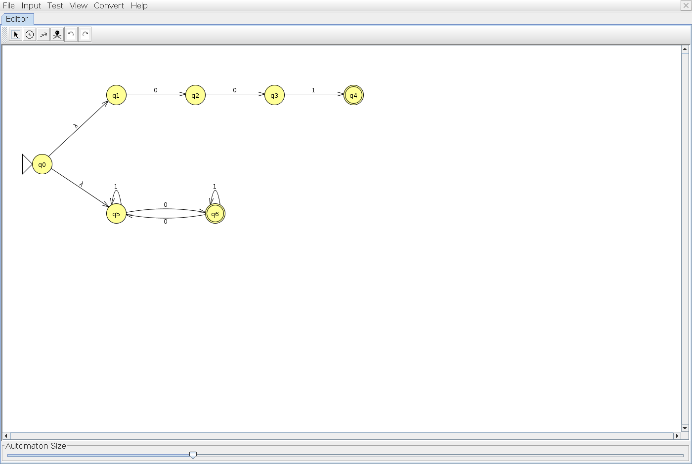
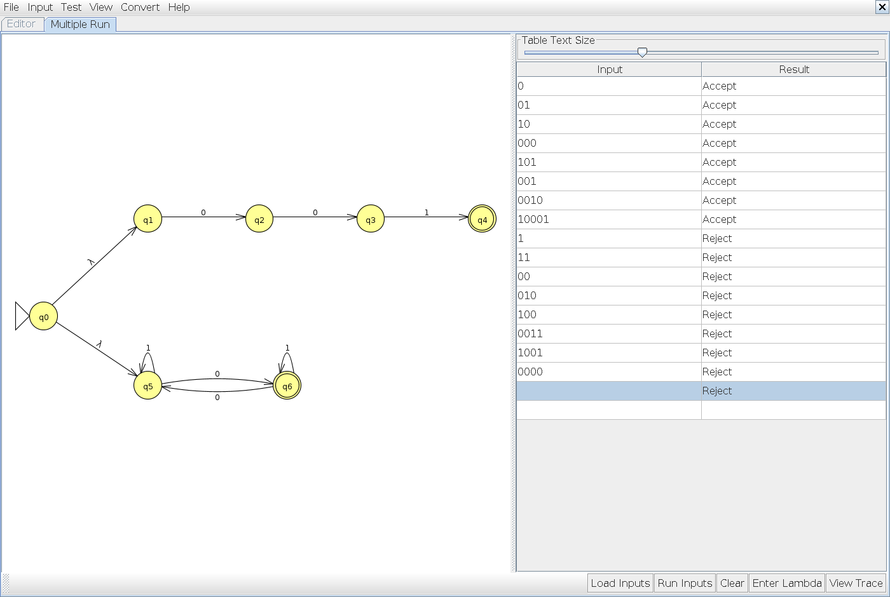
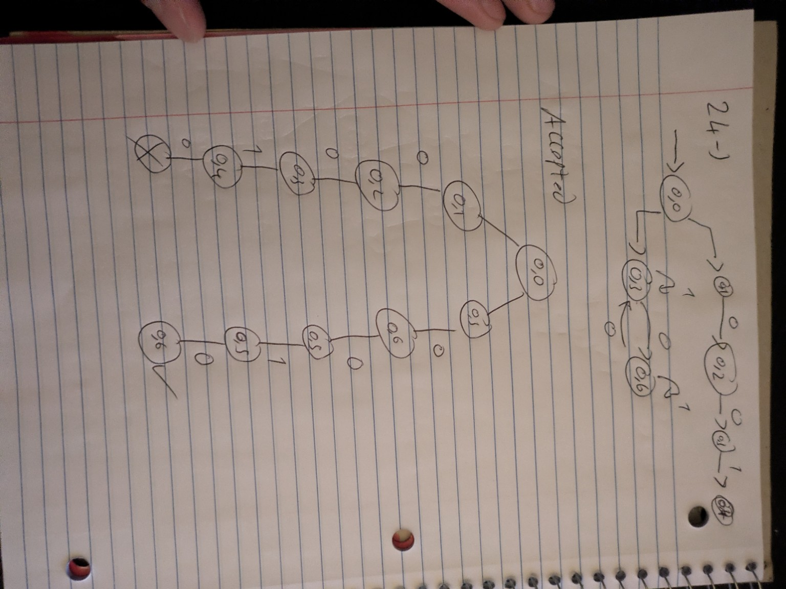
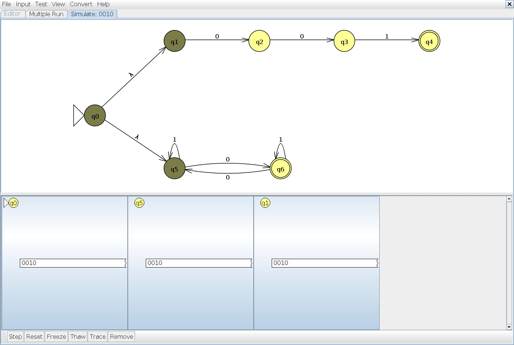

# Problem 24

**Language:** Binary strings that have an odd number of 0s or are exactly 001. Alphabet: {0, 1}.

Statement transcribed from [a supplied reference](https://github.com/c50-31-26F/Matthew_Sychareun_NFA_Design_Exercise_1/blob/main/NFA_Problems.md); confirm its numbering against Teams before submission.

## NFA

The upper branch q1 → q2 → q3 → q4 accepts exactly 001. The lower branch tracks zero parity: q5 means even and q6 means odd; reading 1 leaves the parity unchanged. The start state has lambda transitions to q1 and q5. A complete accepting path on either branch is enough. State names were aligned with the submitted drawing; the recognized language is unchanged.

Start state: q0. Accepting states: q4, q6. Unlisted transitions have no destination; that computation path stops.

## Tests and expected results

Load `n24t.txt` through **Input → Multiple Run → Load Inputs**. It contains 8 accepted strings followed by 8 rejected strings. Select the last blank row and add the empty string using **Enter Lambda/Epsilon**; do not type the word `epsilon`. The appended empty-string case is also rejected.

| Input | Expected | Case |
|---|---|---|
| `0` | Accept | Shortest accepted |
| `01` | Accept | Typical / boundary |
| `10` | Accept | Typical / boundary |
| `000` | Accept | Typical / boundary |
| `101` | Accept | Typical / boundary |
| `001` | Accept | Typical / boundary |
| `0010` | Accept | Typical / boundary |
| `10001` | Accept | Typical / boundary |
| `1` | Reject | Rejected boundary / near miss |
| `11` | Reject | Rejected boundary / near miss |
| `00` | Reject | Rejected boundary / near miss |
| `010` | Reject | Rejected boundary / near miss |
| `100` | Reject | Rejected boundary / near miss |
| `0011` | Reject | Rejected boundary / near miss |
| `1001` | Reject | Rejected boundary / near miss |
| `0000` | Reject | Rejected boundary / near miss |
| ε (add with Enter Lambda/Epsilon) | Reject | Empty input |

## JFLAP batch results

The actual JFLAP 7.1 Multiple Run completed all 17 tests: 8 accepted strings, 8 rejected strings, and the empty string (rejected). All results match the expected table. The blank input row with a Reject result is the empty-string test; the unused row below it is not a test.

## Hand-drawn computation: `0010`

Expected result: **Accept**.

There are three zeros, so the parity branch accepts. The exact-001 branch reaches q4 after 001 but cannot consume the final 0. This reverses which branch accepts compared with the separate batch case 001.

This is the original photograph supplied by the student, preserved without changing its handwritten content. The drawing follows the supplied class examples. Its input and state names are matched by the JFLAP captures below.

### Reading and correcting the handwritten notation

The unlabelled split from q0 consists of two ε (lambda) moves; neither consumes a bit. The complete input traced is 0010. The state names follow the photograph: q1–q4 are the exact-001 path; q5 tracks an even number of zeros and q6 tracks an odd number. q4 and q6 are accepting states. Both copies of the q5 → q6 move read 0. The report and JFLAP file supply the formal transition and accepting-state markings where handwriting is incomplete.

A cross denotes a stopped or rejecting path. A check denotes a path that has consumed the entire input in a final state. The input label, missing transition labels, and accepting states are made explicit here so the photographed tree can be checked against the formal NFA.

### State sets after each input symbol

These sets include lambda closure at the start and after every consumed bit. JFLAP may also display dead configurations in red; those are excluded from the active-state sets.

| Symbols consumed | Active states | Remaining input |
|---|---|---|
| `ε` | {q0, q1, q5} | `0010` |
| `0` | {q2, q6} | `010` |
| `00` | {q3, q5} | `10` |
| `001` | {q4, q5} | `0` |
| `0010` | {q6} | `ε` |

### Matching JFLAP Step with Closure screenshots

These are actual JFLAP 7.1 screenshots for the same input as the handwritten tree.

**Initial configurations**

**After reading `0`**

**After reading `00`**

**After reading `001`**

**After reading `0010`**

